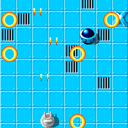

# warp

2005년 1월에 개발한 2D 종스크롤 슈팅 게임입니다. Win32 API와 GDI만 사용하였으며 외부 라이브러리나 게임 엔진은 사용하지 않았습니다. 스프라이트 포맷과 블리팅, 오브젝트 관리, 맵 스크롤을 직접 구현했습니다.



| 항목 | 내용 |
|---|---|
| 작성 시기 | 2005년 1월 |
| 언어와 환경 | C/C++, Win32 API, GDI (Visual C++ 6.0 / Visual Studio 2003) |
| 규모 | 소스 22개 파일, 2,208줄 |
| 화면 | 256x256, 8비트 팔레트 (256색) |

## 빌드와 실행

`build.bat`을 인자 없이 실행하면 `bin\warp.exe`가 생성됩니다.

```
build.bat          릴리스 빌드
build.bat debug    디버그 빌드
build.bat clean    빌드 결과 삭제
```

당시 프로젝트 파일도 함께 포함되어 있습니다. `src\warp.dsw`는 Visual C++ 6.0용, `src\warp.sln`은 Visual Studio 2003용입니다.

x86 환경에서 빌드됩니다. 16비트 윈도우 시절의 메모리 매크로가 포인터를 통과시키는 코드가 남아 있어 64비트 빌드는 지원하지 않습니다.

조작은 좌우 화살표 키로 이동하고 스페이스바로 발사합니다.

## 구성

렌더링 및 메모리 제어를 담당하는 코어 계층과 게임 규칙을 다루는 게임 로직 계층으로 역할을 명확히 분리했습니다. 코어 계층은 게임 규칙을 다루지 않으며, 게임 로직 계층은 DIB나 팔레트와 같은 저수준 버퍼를 직접 제어하지 않습니다.

| 파일 | 역할 |
|---|---|
| `img.c` | DIB 버퍼, 팔레트, 스프라이트 인코딩 및 블리팅 (585줄) |
| `util.h` | 메모리와 파일 접근 매크로, 키 입력 매크로 |
| `main.cpp` | 윈도우 생성, 메인 루프, 게임 상태 전환 |
| `map.cpp` | 타일 맵 생성과 스크롤 |
| `obj.cpp` | 오브젝트 목록 관리 |
| `my.cpp` `tank.cpp` `ship.cpp` `bullet.cpp` `deto.cpp` | 각 오브젝트의 이동 및 렌더링 |
| `res.cpp` | 스프라이트 시트를 잘라 타일 배열로 적재 |

화면은 256x256 크기의 오프스크린 DIB Section에 모두 렌더링한 뒤 한 번의 `BitBlt`로 윈도우에 전송합니다. 팔레트는 `res\warp.pal`에서 읽어오며, 256색 RGB 값이 그대로 포함된 768바이트 바이너리 파일입니다.

## 스프라이트 포맷

팔레트 31번을 투명색으로 사용합니다. 픽셀마다 투명 여부를 비교하며 그리면 연산량이 크게 늘어나므로, 투명 구간의 길이를 미리 계산하여 파일에 저장하고 렌더링 시에는 조건 검사 없이 고속 복사만 수행하도록 구현했습니다.

한 행은 다음과 같은 구조로 저장됩니다.

```
[s16 width][s16 height]

행마다 height번 반복:
  [u16 런 개수]
  런마다: [u16 건너뛸 픽셀 수][u16 찍을 픽셀 수][찍을 픽셀 수만큼의 팔레트 인덱스]
```

`crop_dib_buffer_sprite()`가 비트맵을 순회하며 투명 구간과 불투명 구간의 길이를 번갈아 측정하여 이 구조를 생성하고, `draw_sprite()`가 동일한 구조를 바탕으로 화면에 복사합니다. 렌더링 내부 루프에는 조건 분기가 존재하지 않습니다.

```c
pak_len = *bits++;                  /* 이 행의 런 개수 */
while (pak_len--) {
    skip += *bits++;                /* 투명 구간은 건너뛰고 */
    put_len = *bits++;
    memcpy(vbuf + skip, (LPBYTE)bits, put_len);   /* 불투명 구간만 복사 */
    bits = (LPWORD)((LPBYTE)bits + put_len);
    skip += put_len;
}
```

화면 경계에 걸치는 스프라이트는 `draw_sprite_c()`가 RLE 세그먼트 단위로 클리핑을 수행합니다. 스프라이트가 경계 안에 온전히 포함될 경우에는 불필요한 클리핑 연산을 건너뛰기 위해 `draw_sprite()`로 직행합니다.

.spr 포맷은 단순 파일 용량 압축보다 **렌더링 시 투명 픽셀을 고속으로 건너뛰는(Transparent Skip) 렌더링 연산 최적화**에 초점을 맞춘 RLE 구조입니다.

타일 밀집도가 높은 시트 원본에서는 런 헤더 오버헤드로 인해 파일 크기 절감 효과가 크지 않으나, 플레이어 및 적의 기체, 투사체처럼 여백(투명 영역)이 많은 개별 스프라이트를 화면에 그릴 때 불필요한 픽셀 연산을 줄여 렌더링 성능을 확보했습니다.

원본 그래픽은 PCX 포맷으로 작업한 뒤 `res\conv.bat`을 통해 `pcx2spr` 도구로 변환하여 사용했습니다. 변환 도구 소스는 제외하고 변환 결과물인 `.spr` 파일만 포함되어 있습니다.

## 오브젝트 관리

플레이어, 적, 총알, 폭발 이펙트가 모두 동일한 `OBJECT` 구조체를 공유하며, 각자의 세부 동작은 함수 포인터를 통해 다형적으로 분기됩니다.

```c
struct OBJECT {
    OBJp next, prev;
    int x, y;
    ...
    RUNp move, draw;    /* initTank, initShip 등이 각자의 함수를 타입을 꽂는다 */
    void *data;
};
```

`moveAllObject()`는 전체 오브젝트 목록을 순회하며 `o->move(o)`를 호출하기만 하므로 객체의 구체적인 타입을 알 필요가 없습니다. 따라서 새로운 적이나 오브젝트를 추가하더라도 목록 순회 및 관리 코드는 수정할 필요가 없습니다.

## 맵과 스크롤

맵은 32x32 크기의 타일을 8열 9행 배열로 관리합니다. 한 행만큼 스크롤될 때마다 배열을 한 칸씩 밀어내고 상단에 새로운 행을 생성하면서 해당 행의 빈 위치에 적 오브젝트를 배치합니다.

스크롤 위치를 나타내는 `vy`는 뷰포트의 화면 위치인 동시에 모든 월드 오브젝트 좌표의 기준점이 됩니다. 오브젝트는 월드 절대 좌표를 유지하며, 렌더링 시 `vy`와의 상대적인 차이를 계산하여 화면 좌표를 도출합니다.
